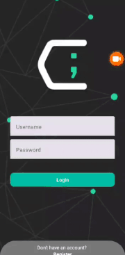
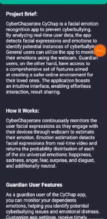
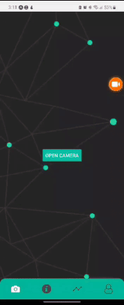
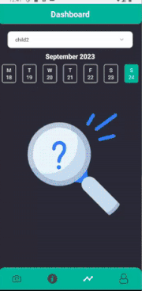
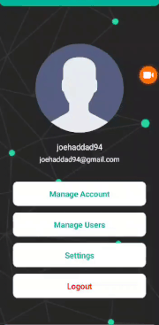
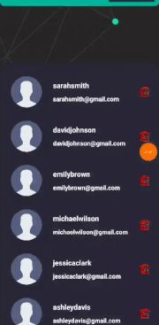
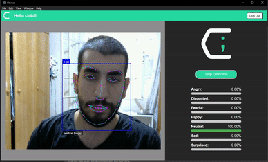

<br><br>

<!-- project philosophy -->


> CyberChaperone, an AI-powered facial emotion recognition application designed to prevent cyberbullying. By analyzing real-time user data, the app detects facial expressions and emotions to identify potential instances of cyberbullying.
>
> General users can utilize the software application to monitor their emotions using the webcam. Guardian users, on the other hand, have access to a comprehensive set of features aimed at creating a safer online environment for their loved ones. The application boasts an intuitive interface, enabling effortless interaction, result sharing.

### User Stories
- As a general user, I want to sign in to the app using my credentials to access the webcam-based emotion detection feature.

- As a guardian user, I want to view detection results of my dependents.
- As a guardian user, I want to have a demo of how the detection works.
- As a guardian user, I want to view detailed emotional analysis to gain insights into my dependents' overall well-being using AI.

<br><br>

<!-- Prototyping -->


> We designed CyberChaperone using wireframes and mockups, iterating on the design until we reached the ideal layout for easy navigation and a seamless user experience.

### Mockups (Mobile App)
| Login screen  | Register Screen | Camera Screen |
| ---| ---| ---|
|  |  |  |

| Info screen  | Dashboard Screen | Profile Screen |
| ---| ---| ---|
|  |  |  |

| Users screen  | Create Users Screen | |
| ---| ---| ---|
|  |  |

### Mockups (Software App)

| Login Page  | Landing Page ||
| ---| ---| ---|
|  |  

<br><br>

<!-- Implementation -->


> Using the wireframes and mockups as a guide, we implemented the CyberChaperone app with the following features:

### User Screens (Mobile)
Login screen  | Info Screen | Camera Screen |
| ---| ---| ---|
|  |  |  |

| Dashboard Screen  | Profile Screen | Users Screen |
| ---| ---| ---|
|  |  |  |

### User Screens (Software App)

| | Landing Page ||
| ---| ---| ---|
| |  

<br><br>

<!-- Tech stack -->


###  CyberChaperon is built using the following technologies:

- This project relies on [React Native](https://reactnative.dev/) with [TypeScript](https://www.typescriptlang.org/) for app development. React Native is a versatile cross-platform mobile app development framework that enables us to create applications for both iOS and Android.
- This project uses [Electron](https://www.electronjs.org/) as a framework for building cross-platform desktop applications using web technologies like HTML, CSS, and JavaScript, allowing developers to create desktop software for Windows, macOS, and Linux from a single codebase.
- This project uses [Laravel](https://laravel.com/), a PHP web application framework, with MySQL as the database management system. Laravel simplifies web development by providing robust tools and an expressive syntax for building secure and scalable web applications.
- This Project uses [Node.js](https://nodejs.org/en) to handle data management while using [socket.IO](https://socket.io/), a websocket to facilitate data broadcast.

<br><br>

<!-- How to run -->


> To set up CyberChaperone locally, follow these steps:

## Prerequisites

* Github
  ```sh
  git clone https://github.com/joehaddad94/CyberChaperone.git
  ```

## Installation

   ### Electron Software App:
1. Navigate to electron folder.
   ```sh
   cd electron
   ```
2. Install NPM packages
   ```sh
   npm install
   ```
3. Run the app
   ```js
   npm start
   ```
### React Native App:
1. Navigate to client-RN folder.
   ```sh
   cd client-RN
   ```
2. Install NPM packages
   ```sh
   npm install
   ```
3. Run the app
   ```js
   npm start
   ```
   
### Node.js:
1. Navigate to server-node folder.
   ```sh
   cd server-node
   ```
2. Install npm packages
   ```sh
   npm install
   ```
3. Run the server
   ```js
   node server.js
   ```

### Laravel:
1. Navigate to server-laravel folder.
   ```sh
   cd server-laravel
   ```
2. Rename the `.env.example` file to `.env` and name your database.
3. Install packages
   ```sh
   composer install
   ```
4. Make the migrations.
   ```js
   php artisan migrate
   ```
5. JWT Token
   ```js
   composer require php-open-source-saver/jwt-auth
   ```
   ```js
   php artisan vendor:publish --provider="PHPOpenSourceSaver\JWTAuth\Providers\LaravelServiceProvider"
   ```
   ```js
   php artisan jwt:secret
   ```
6. Run the server
   ```js
   node server.js
   ```
### XAMPP:
1. Install XAMPP.
2. Start Apache.
3. Start MySQL.

Now, you should be able to run all platforms locally and explore its features.

# Postman

This is a JSON file for the postman APIs collection for this project [CyberChaperone.postman_collection.json](/readme/CyberChaperone_postmanCollection.json). You can change the address of the APIs to test them with postman.